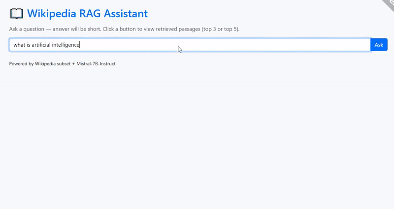

## 🎥 Demo




# 📖 Wikipedia RAG Assistant

A **Retrieval-Augmented Generation (RAG)** project that lets you ask natural language questions and get short, context-aware answers from a small subset of English Wikipedia.

This repository contains:
- `build_index.py` → Downloads a small subset of Wikipedia, chunks it, creates embeddings, and builds a FAISS index.
- `app.py` → Flask web app that loads the index, retrieves relevant chunks, and queries a **Mistral-7B-Instruct** model using HuggingFace Inference API.

---

## 🚀 Features
✅ Wikipedia subset → cleaned and chunked  
✅ FAISS index for fast semantic search  
✅ SentenceTransformer embeddings  
✅ Mistral-7B-Instruct for concise answers  
✅ Bootstrap + Flask frontend  
✅ Ngrok tunnel for public access  

---

## 🛠️ Setup & Usage

1️⃣ Install Dependencies
```bash
pip install -r requirements.txt
```
2️⃣ Build the Index
Run build_index.py to download and preprocess data:
```bash
python build_index.py
```
3️⃣ Run the App
```bash
python app.py
```
📊 Dataset Details
Source: wikimedia/wikipedia on Hugging Face → https://huggingface.co/datasets/wikimedia/wikipedia

Subset: 20231101.en (first 1,000 rows)

Storage: metadata.parquet + embeddings.npy

